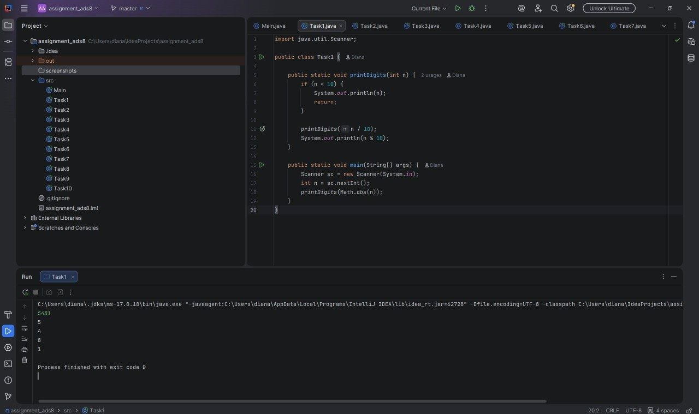
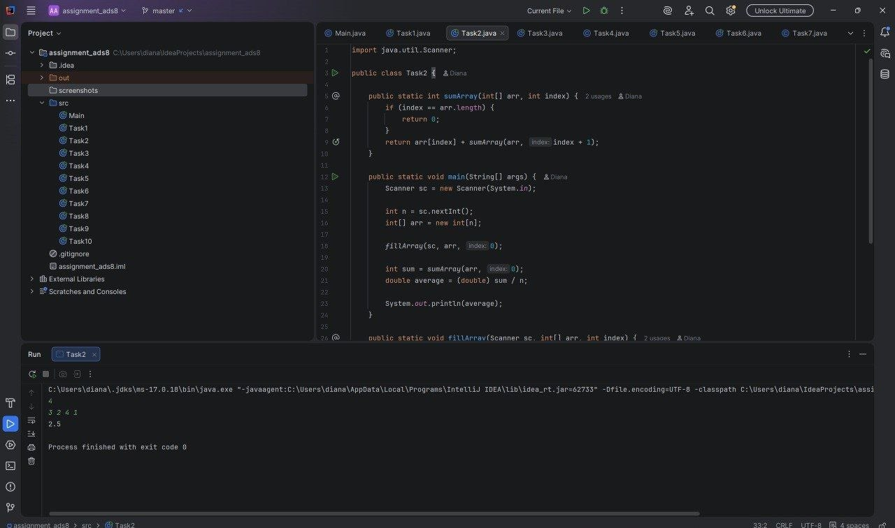
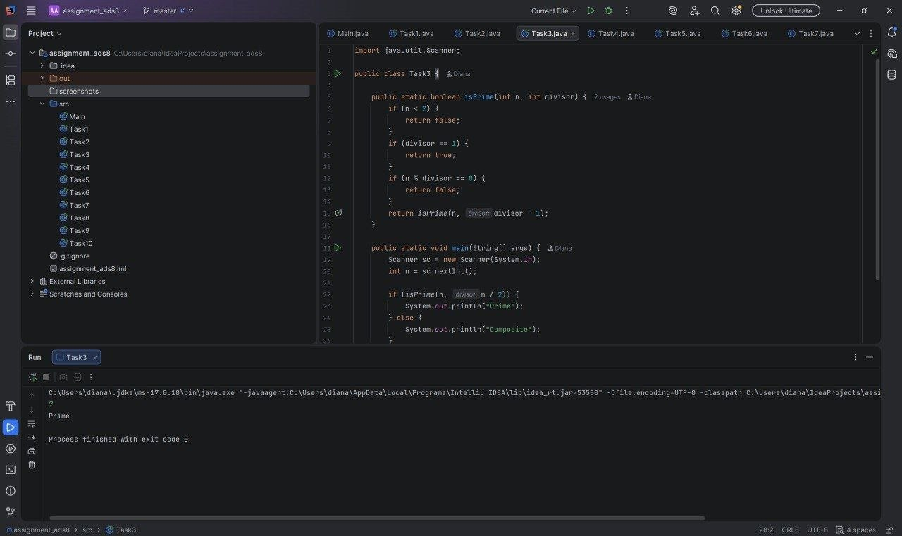
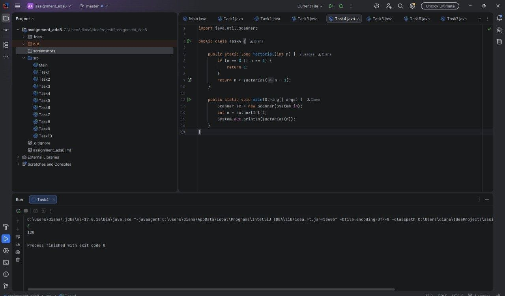
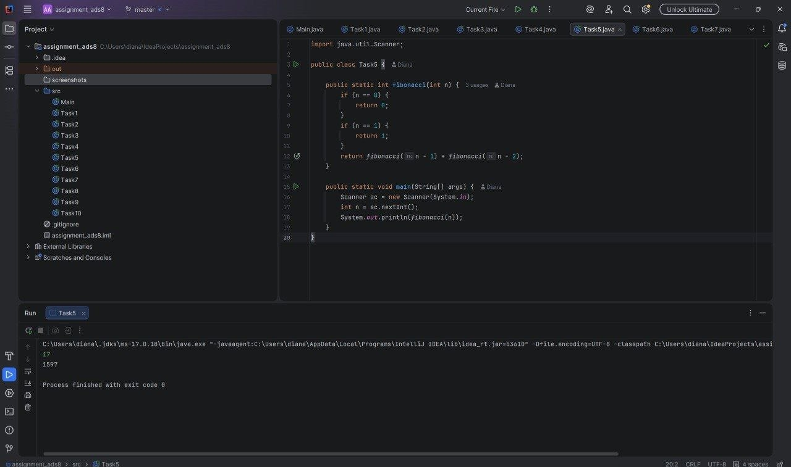
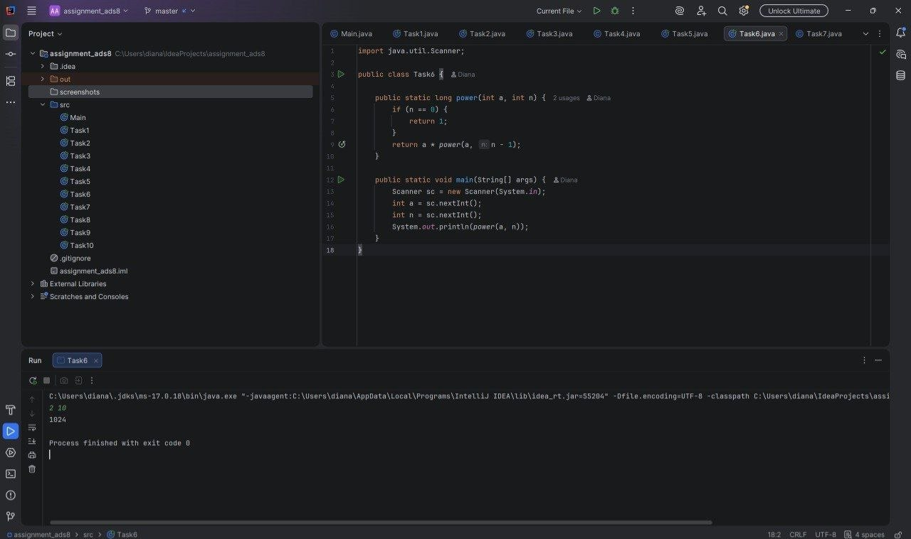
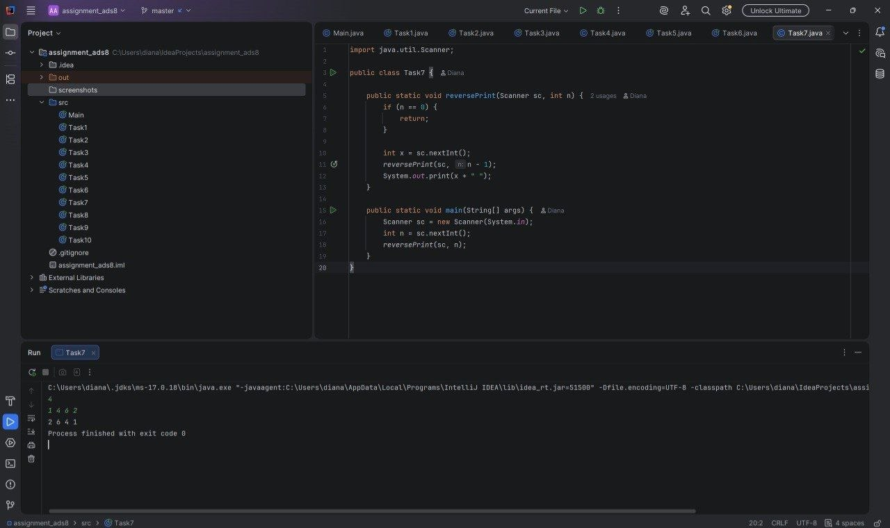
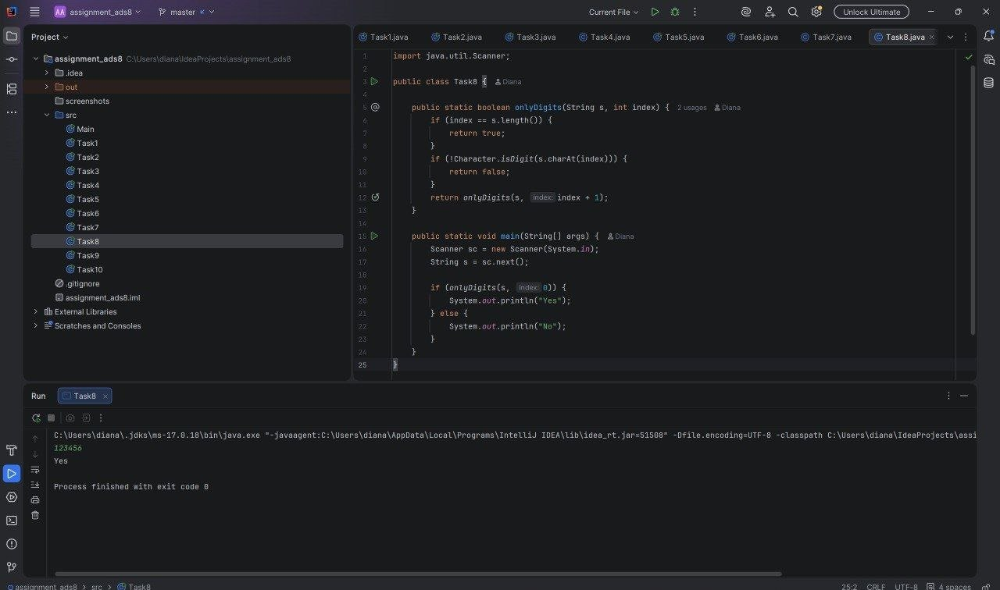
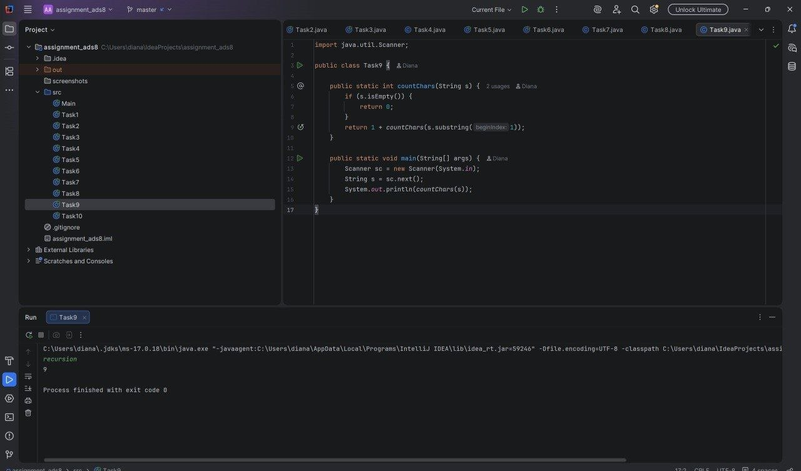
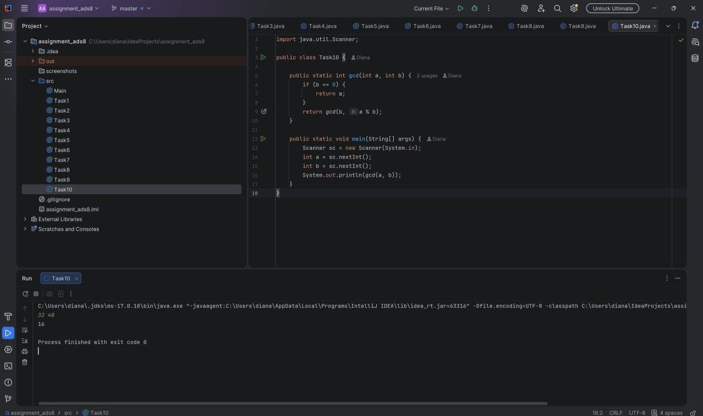

# Assignment 1 - Recursion

## Student's name
Diana Issen

## Group number
SE-2514

## Summary
In this assignment, I implemented 10 tasks using recursion in Java. 
I have solved all the tasks without any usage of loops (for, while, do-while). 
Every task is implemented in a separate Java class.

## Task 1 - Print Digits
This program prints each digit of a number using recursion.

## Task 2 - Average of Elements
This program calculates the average of the array elements using recursion.

## Task 3 - Prime Check
This program checks whether a number is prime or composite using recursion.

## Task 4 - Factorial
This program calculates the factorial of a number recursively.

## Task 5 - Fibonacci
This program finds the nth Fibonacci number using recursion.

## Task 6 - Power Function
This program calculates a^n using recursion.

## Task 7 - Reverse Output
This program prints numbers in reverse order using recursion.

## Task 8 - Check Digits in String
This program checks if a string contains only digits.

## Task 9 - Count Characters
This program counts the number of characters in a string recursively.

## Task 10 - GCD
This program finds the greatest common divisor using recursion.

